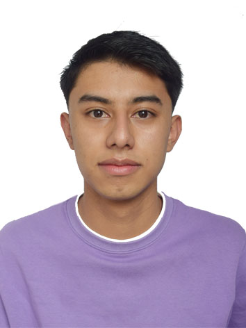

## Hi, I am Brayan!
###I'm from Colombia a beautiful country located in north of South America, specifically from Bogota which is its capital. I'm 19 years old.
To begin with, I was born in Bogota but in my childhood I was living in 2 towns approximately 2 hours from the capital, the first place is called Simijaca where you can find a lot of cob crops which can be use to make a typical Colombian dish known as "envuelto", I think it don't have an official translation to English but its delicious, likewise, near to Simijaca there is a town called Ubate where is known as dairy capital as you can find many kinds of cheese and basically all the edible products come from milk. The second one is called Anolaima known as fruit capital in Colombia. There is an special religious event in this place called "Corpus Christi" where some people make different figures made only with fruit and sugar cane, such as car, a house, an animal or even an small church.
In my free time I like to play video games, watch movies or series on Netflix, read books , drawing or even travel and discover new places. Also I like some sports such as basketball or volleyball but I'm not a big fan. Additionally I like to ride a bike and travel long distances.  

